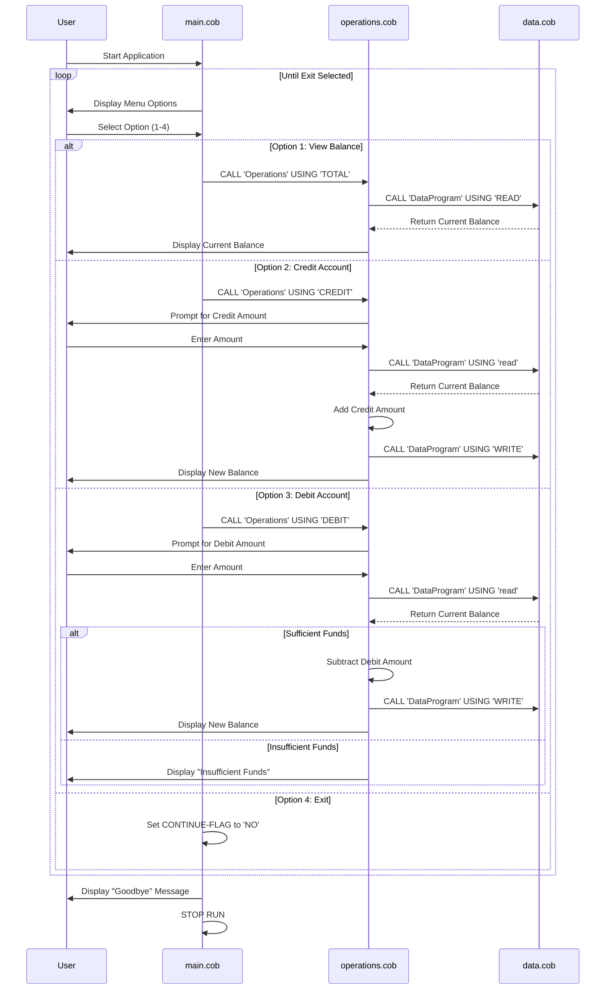

# School Legacy COBOL Accounting System Documentation

## Overview

This documentation describes the school's legacy COBOL accounting system, a simple account management application built with three interconnected COBOL programs. The system provides basic functionality for managing student account balances including viewing balances, crediting accounts, and debiting accounts.

## System Architecture

The system consists of three main COBOL programs that work together to provide a complete accounting solution:

### File Structure

```text
src/cobol/
├── main.cob        # Main program with user interface
├── operations.cob  # Business logic for account operations
└── data.cob       # Data storage and retrieval
```

## Program Details

### 1. main.cob - Main Program

**Purpose**: Entry point and user interface controller

**Key Functions**:

- Displays the main menu with 4 options:
  1. View Balance
  2. Credit Account
  3. Debit Account
  4. Exit
- Handles user input validation
- Controls program flow through menu loop
- Calls appropriate operations based on user selection

**Business Rules**:

- Continuously loops until user selects exit (option 4)
- Invalid menu selections display error message
- Uses CALL statements to invoke operations

### 2. operations.cob - Business Logic

**Purpose**: Implements core accounting operations

**Key Functions**:

- **TOTAL**: Retrieves and displays current account balance
- **CREDIT**: Adds money to the account
  - Prompts user for credit amount
  - Reads current balance
  - Adds credit amount to balance
  - Saves updated balance
  - Displays new balance
- **DEBIT**: Removes money from the account
  - Prompts user for debit amount
  - Reads current balance
  - Validates sufficient funds
  - Subtracts debit amount if funds available
  - Saves updated balance or displays insufficient funds message

**Business Rules**:

- Debit operations require sufficient funds validation
- All monetary amounts are stored with 2 decimal places (PIC 9(6)V99)
- Operations use the DataProgram for all data persistence

### 3. data.cob - Data Management

**Purpose**: Handles data storage and retrieval operations

**Key Functions**:

- **READ**: Retrieves current balance from storage
- **WRITE**: Saves balance updates to storage

**Business Rules**:

- Initial account balance is set to $1000.00
- Balance is stored in WORKING-STORAGE as STORAGE-BALANCE
- Uses LINKAGE SECTION for parameter passing between programs

## Data Flow

The system follows a simple data flow pattern:

1. **User Interaction**: User selects menu option in main.cob
2. **Operation Routing**: main.cob calls operations.cob with operation type
3. **Data Access**: operations.cob calls data.cob for read/write operations
4. **Response**: Results flow back through the call chain to display to user

## Technical Specifications

### Data Types

- **Account Balance**: PIC 9(6)V99 (up to $9999.99 with 2 decimal places)
- **Operation Types**: PIC X(6) (6-character string identifiers)
- **User Input**: PIC 9 (single digit for menu choices)

### Program Communication

- Uses COBOL CALL statements for inter-program communication
- LINKAGE SECTION for parameter passing
- USING clause for passing data between programs

### Memory Management

- WORKING-STORAGE SECTION for local variables
- Persistent balance storage in data.cob
- GOBACK statements for proper program termination

## Business Requirements Summary

1. **Account Balance Management**: Track and maintain student account balances
2. **Credit Operations**: Allow adding funds to student accounts
3. **Debit Operations**: Allow removing funds with overdraft protection
4. **Balance Inquiry**: Provide current balance viewing capability
5. **User Interface**: Simple menu-driven interface for non-technical users
6. **Data Persistence**: Maintain balance information across program sessions

## System Limitations

- Single account system (no multi-user support)
- No transaction history or audit trail
- Limited error handling and validation
- No backup or recovery mechanisms
- Fixed initial balance of $1000.00
- Maximum balance limit of $9999.99

## Sequence Diagram



---

*This documentation serves as a foundation for understanding the legacy system before modernization efforts begin.*
